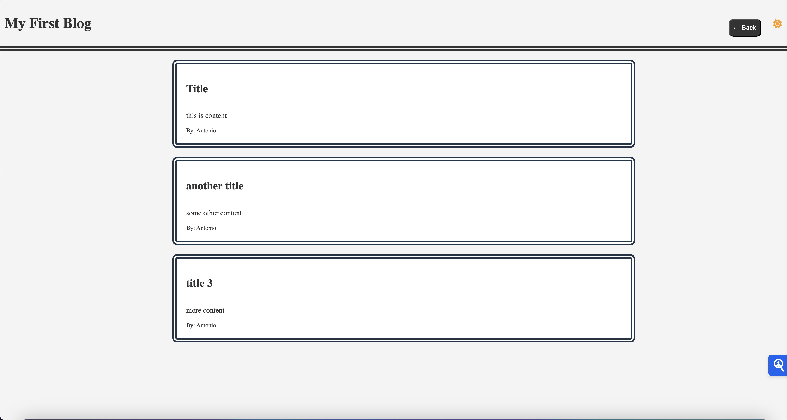

# Blog Post Application

Welcome to the Blog Post Application! This application is designed to provide an intuitive and seamless experience for creating and managing blog posts. It includes several powerful features such as form-based input, dynamic rendering, navigation capabilities, theme switching, and data persistence using local storage. Here’s a detailed overview of the application and its features:

## Features

### Form-Based Input
The application starts with a user-friendly form where you can enter the details of your blog post, including the title, content, and your username. This form ensures that all necessary information is captured accurately and efficiently.

### Dynamic Rendering to Blog Page
Once you submit the form, the information is dynamically rendered onto a separate page, `blog.html`. This provides a clear and organized display of your blog posts, making it easy for readers to engage with your content. 

### Navigation Capabilities
The application also includes the ability to navigate back to the previous page, allowing you to add more blog posts. This feature ensures a smooth and continuous blogging experience without losing any data or progress.

### Light Mode and Dark Mode
Recognizing the importance of user comfort and accessibility, the application includes both light mode and dark mode. This feature allows users to switch between modes based on their preference or the ambient lighting conditions, reducing eye strain and enhancing readability.

### Data Persistence with Local Storage
To ensure that your blog posts are saved and persist across sessions, the application utilizes the browser's local storage. This means that even if you close the browser or refresh the page, your blog posts will remain intact and accessible the next time you open the application.

[Click here](https://antoniokod.github.io/blog_assignment/index.html)

